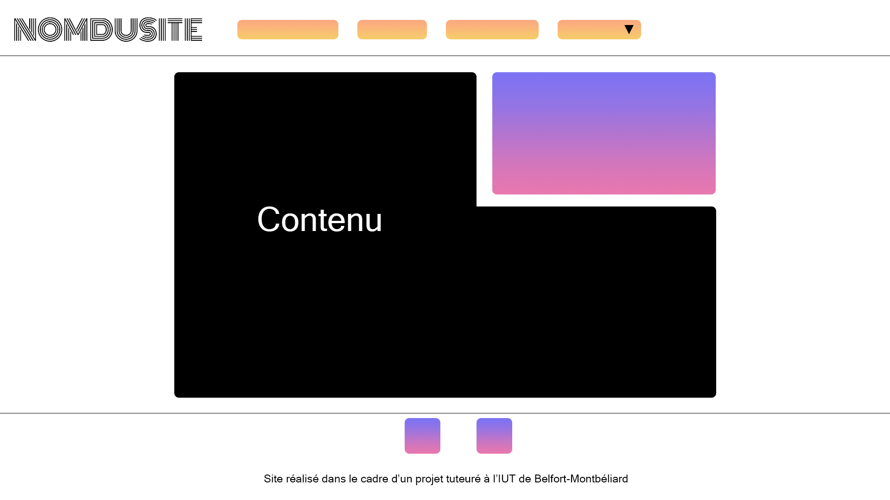
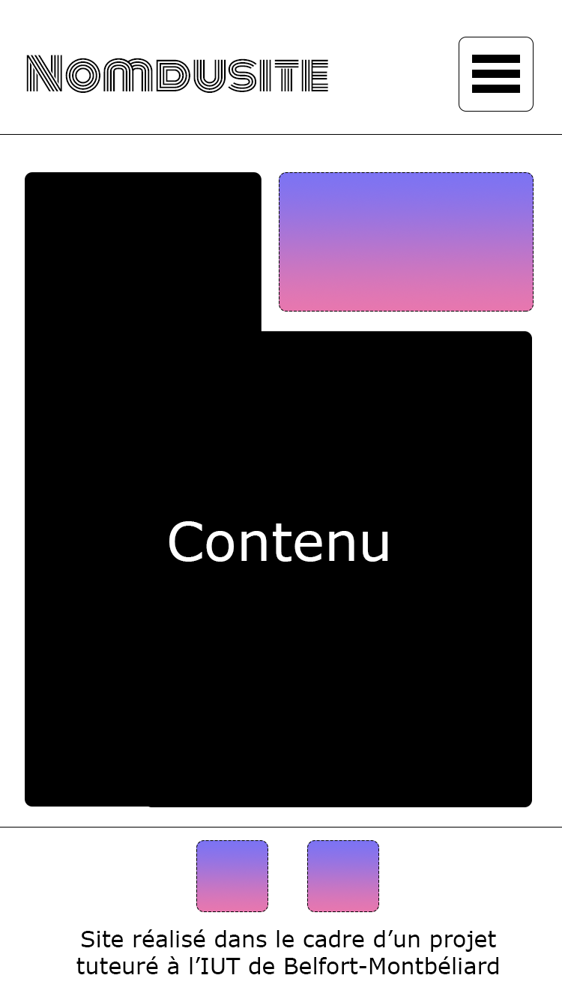

# Projet tuteuré de S1 | 2020

## Sujet

Analyse de la création d'un système de ventes et d'échanges entre étudiants

## Composition du groupe

*  Nathan **BLIND HEITZ** (👑)
*  Émile **BATKOWSKI**
*  Jules **DELERS**
*  Léo **HUGONNOT**
*  Vassily **DELMAS**

## Tuteurs

*  Ingrid **COUTURIER** (Fond)
*  Alain **MILLET** (Forme)
*  Thierry **SAHLER** (Éco-Droit)

## Tracés régulateurs

### Ordinateur

### Téléphone

## Documents

Chemin d'accès : 

## URL du site hébergé
[ptuts1.notavone.fr](https://ptuts1.notavone.fr/)

---